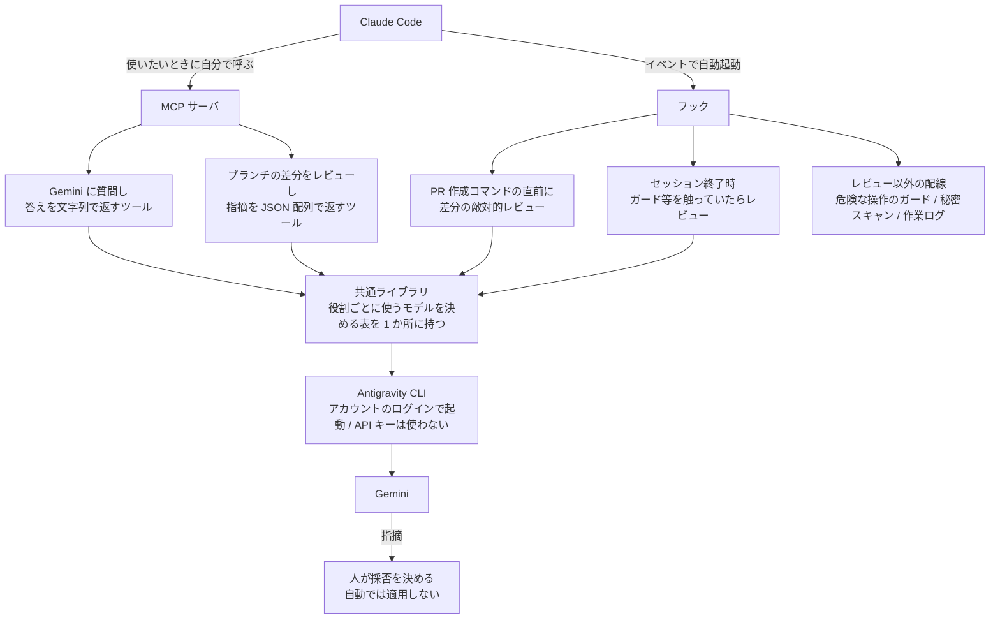

## はじめに

Claude Code に書かせたコードを自分で読み返し、気になったところを同じ Claude に指摘させ、また直す往復に疲れてきたので、読む係を Gemini に替えました。この記事では、その繋ぎ方と、実際に何件当たったのかを書きます。

先に断っておくと、これは自分ひとりの個人開発での運用で、チームに導入した実績はありません。正解を示すものではなく、同じように困っている人の参考になれば幸いです。用語を 3 つだけ決めておきます。

- **セルフレビュー**: この記事では、書かせた本人が目視で読み返すこと、あるいは書いたモデル自身に読み返させることを指します。
- **敵対的レビュー**: 良いところを褒めさせず、壊れる条件や迂回できる経路、説明と実装の食い違いだけに絞って指摘させるレビューを指します。
- **ガード**: 危ない操作（強制的な巻き戻しや、秘密情報の書き込みなど）を機械的に止める自作の仕組みを指します。この記事では、レビューの対象としてたびたび登場します。

運用そのものは単純です。差分がまとまった段階でレビューを走らせ、返ってきた指摘を再現してから直し、次の作業に進みます。実装を進める前に潰しておくと、あとから設計を見直すような高くつく失敗が減ります。

## なぜ Gemini に叩かせているのか

はじまりはトークンの使用量でした。Claude Code を毎日使っていると上限に当たるようになり、このままの使い方では下がらないと感じたのが最初です。節約でまず思いつくのは、出力を短くさせる、軽いモデルに切り替えるといった、1 回あたりを安くする工夫です。ひととおり試しましたが、思ったほど減りませんでした。しばらくして分かったのは、自分の場合に負担が大きかったのは規模ではなく回数だったことです。同じところを何度も作り直していました。

手戻りで消えるトークンは高くつきます。書き直すコードそのものより、そこまでの経緯を読み直させるコンテキストが毎回ついてきます。実装が一通り終わってから設計の誤りに気づくと、現状を全部読ませ直すところからやり直しです。ファイルが増えた後なので、最初に作ったときより読ませる量は多くなります。裏を返せば、作り直しの回数が減ればトークンも減ります。1 回を安くするより、そちらに賭けることにしました。

もう 1 つは、セルフレビューの限界です。LLM はどれだけ高性能になっても、学習データと評価のしかたによる偏りが残ります。Claude Code が書いたものを Claude に読ませると、書いたときと同じ偏りで読むことになり、死角も共通します。自分が目で追う場合も同じで、書いたときに見落とした前提は、読み返しても見落とします。別のデータと別の基準で作られた Gemini なら、偏りの向きが違うぶん、こちらが当然だと思っていた前提を疑ってきます。

## 2 つの繋ぎ方

呼び出し口は 2 つあります。1 つは MCP サーバとして 2 つのツールを Claude Code に見せておき、使いたくなったら Claude Code 自身に呼ばせる形です。もう 1 つは Claude Code のイベントに紐づけたフックで、こちらは呼ぶのを忘れても走ります。どちらも同じ共通ライブラリを通り、Gemini を動かす CLI（Antigravity CLI）を起動するところで合流します。

図では並べて描いていますが、この 2 つは性格が違います。自分で呼ぶほうは相談にも翻訳にも使える汎用の口で、そのかわり呼び忘れれば何も起きません。フックのほうは、PR を出すコマンドを打った瞬間と、ガードのような壊れると困る部分を触ったままセッションを終えようとした瞬間に、こちらの意思と関係なく差分を持っていきます。自分が実際に助かっているのは後者です。

共通ライブラリに置いてあるのは、レビュー役・書く役・仕分け役といった役割ごとにどのモデルを使うかを決めた表で、呼ぶ側はモデル名を知りません。乗り換えるときに直すのは 1 か所です。どちらの経路でも返ってくるのは指摘までで、直すかどうかは自分が決めます。AI だけで採否まで決めさせると品質が落ちるというのが、これまでの実感です。

図にあるとおり、この配線に乗っているのはレビューだけではありません。ガードも秘密スキャンも作業ログも、同じフックの仕組みに相乗りしています。次に書く 300 行弱は、このうちレビューの本体だけを切り出した数字です。

## 作ったのは 2 ファイル、300 行弱

割に合うのかが気になると思うので、実装の規模感と日数を先に書いておきます。レビューを手で回すスクリプトが 140 行で、作り始めた翌日の 2026-09-12 に最初の実行が通りました。編集を検知して自動で起動する部分が 143 行で、こちらが動いたのは 2026-09-13 です。本体はこの 2 ファイル、合わせて 300 行弱です。手で回すだけなら 1 日、自動起動まで入れて 2 日でした。ただしこれは切り出した数字で、周辺を含めた自作のハーネス（Claude Code のプラグインとして作っています）全体には、2026-09-11 から 09-18 までの 8 日間で 169 コミット入っています。レビューはその一部です。

費用の面では、Antigravity CLI をアカウントのログインだけで動かしていて、API キーは渡していません。この CLI はアカウントを作ってログインすれば無料のプランで始められます（無料プランの上限は週ごとにリセットされます）。従量課金が発生しない代わりに、使えるのはアカウントに紐づく上限までです。上限に当たったら待ちます（有料クレジットへの自動課金設定は切ってあります）。止めたくなったときは、フックの設定から 1 行消せば自動起動は止まります。

試すだけなら、必要なのは次の 2 つだけです。

- Antigravity CLI をインストールして、アカウントでログインする（API キーの発行は不要）
- `git diff` の出力と、敵対的レビューを指示するプロンプトを繋いで CLI に渡すスクリプトを 1 本書く

MCP サーバも自動起動の仕掛けも後回しで構いません。最初の 1 日は、差分が出たときに手動で CLI へ流し込んで確認するだけでした。

## 返ってきた指摘は鵜呑みにしない

具体例を 1 つ挙げます。この自作のハーネスには、危ない操作を止めるガードを入れてあります。2026-09-14、変更をマージに出す前に手でレビューを回したところ、構造的な穴が 5 件返ってきました。中でも大きかったのは、コマンドの行頭に空白やタブを 1 つ入れるだけでガードの判定を丸ごと迂回できる、という指摘です。書いた本人は行頭から始まる形でしか試していなかったので、まったく見えていませんでした。

ただ、指摘をそのまま信じて直すことはしません。まず指摘どおりの入力を作り、本当に素通りするかを再現します。再現できたら、それをテストとして固定してから直します。この回は 5 件とも再現できて全部当たりでしたが、外れる回もあるので順序は変えていません。再現から入ると、直したあとにテストが残ります。

## 何件当たったのか

トークン代がいくら下がったのかは計算していません。同じ条件で比較する手間をかけていないので、何割削減といった数字は出せません。

金額の代わりに数えているのは、レビューを何回走らせて、そのうち何件が本当に当たったかです。再現を試して判定を書き終えた回を並べます。

| 日付 | 見せたもの | 指摘 | 内訳 |
|---|---|---|---|
| 2026-09-13 | リポジトリ全体 | 18 件 | 当たり 8 / 条件付き 2 / 外れ 5 / 利用者判断 3 |
| 2026-09-14 | マージに出す前の差分 | 5 件 | 全件当たり（うち重大 4） |
| 2026-09-18 | ガードを編集した直後（自動起動） | 6 件 | 全件外れ |
| 2026-09-18 | 作業の振り返りそのもの | 9 件 | 当たり 5 / 外れ 2 / 対応不要 2 |

合計 38 件、当たりは 18 件です。ただ、この合計にはあまり意味がありません。的中率が回によって 100% から 0% まで振れていて、平均を取ると「だいたい半分当たる」という、どの回にも当てはまらない数字になります。

丸ごと空振りした 3 行目は、モデルの調子ではなく渡し方の問題でした。このときレビューに入ったのは、守ってほしい制約を書いた文書の差分だけです。その制約を実際に強制している実装（実行できるツールの許可リストと、コマンドを判定するガード本体）は差分に含まれておらず、読まれていません。返ってきた 6 件は全部「こういう実装になっている場合」という仮定から書かれていて、実入力を通すと、抜けると言われた操作は止まり、誤って止まると言われた操作は素通りしました。レビュー対象の選び方を外すと、返ってくるのは推測だけになります。

この回は外れが分かったあとも、対照としてテストに足しました。そこでこちらの前提が崩れました。保護対象の隣に書き込む操作を「止まるはず」と書いたら、テストが失敗したのです。調べるとガードはディレクトリ名の一致ではなく解決後のパスで判定していて、自分の書いた期待値のほうが間違っていました。外れの回でも、思い込みの棚卸しにはなります。

それでも早い段階で叩いてもらう価値はあると考えています。当たったほうの中身が、後から発覚していたら設計の作り直しに直結するものばかりでした。行頭に空白を足すだけでガードが素通りになる件は、マージしてから見つかっていたら、そのガードが止めてくれる前提で書いた周辺まで見直しになっていました。

設計の穴が早い段階で出てくるようになり、作り終わってから作り直す回数は目に見えて落ちました。無駄なコンテキストを読ませずに済むぶん、トークンも減っているはずだと考えていますが、これは実感であって計測ではありません。

## チームでの実績はありません

この運用は個人開発のもので、チームに導入した実績はありません。複数人で回したときに何が起きるかは分からない、というのが本当のところです。

他人に配る前提の作りにはしてあります。配布用のスクリプトで、登録済みの 9 リポジトリへ同じ仕組みをまとめて入れられますし（手元の複数のアプリで実際に動かしています）、ガードには、素通りするはず／止まるはずの入力を並べた対照テストが 351 件と、それとは別に単体テストが 144 件あります。判定を迂闊に緩めればテストが赤くなるので、壊したまま配ることは一応できません。ただ、渡せる形にしてあることと、渡した先でうまく回るかどうかは別です。

人が増えたときに最初に壊れるのは、ガードそのものではなく誤検知の調整だと思っています。何を止めて何を通すかの線引きが自分の感覚で引いてあり、根拠が自分の中にしかありません。今もヒアドキュメントで文書を書こうとすると自分のガードに止められる不便が残っていて、これは書き方を変えて避けています。自分ひとりなら「まあいいか」で済みますが、他人が同じことを踏んだら、たぶんガードごと外されます。そこをどう設計するかは、まだ決められていません。

## まとめ

やっていることは、Claude Code が書いたものを Gemini に敵対的にレビューさせ、返ってきた指摘を再現してから直す、というだけです。繋ぎ方は MCP サーバとフックの 2 経路で、前者は使いたいときに Claude Code 自身が呼び、後者は PR の直前とセッション終了時に勝手に走ります。手で回すスクリプト 1 本と CLI のログインがあれば、最小構成は動きます。

コストがいくら下がったのかは、数字を出せないままです。数えているのは指摘の当たり外れだけで、38 件中 18 件、的中率は回ごとに大きく振れます。それでも、後から見つかっていたら設計の作り直しになっていた穴が早い段階で出てくるので、自分は続けています。

セルフレビューの往復に疲れていて、心当たりが「同じところを何度も作り直している」ことなら、Gemini のような別のモデルに叩かせる経路を 1 本用意してみる価値はあると思います。毎回当たるわけではないので、返ってきたものを再現してから直す手順だけは一緒に用意してください。
