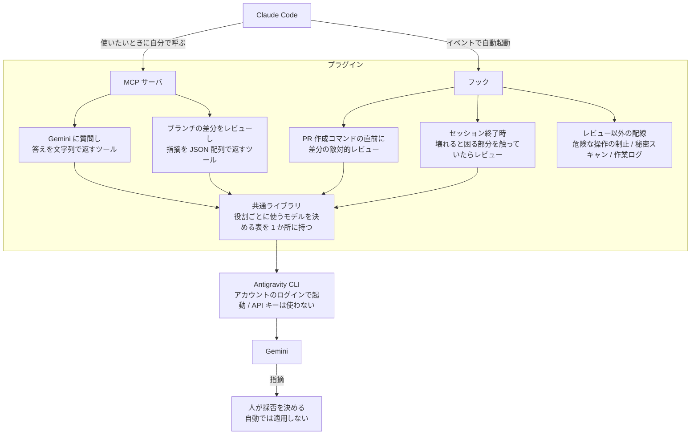

## はじめに

Claude Code に書かせたコードを同じ Claude に読み返させる往復に疲れ、読む係を Gemini に替えました。繋ぎ方と、実際に何件当たったのかを書きます。

個人開発での運用で、チームでの実績はありません。ただ、仕組み一式は Claude Code のプラグインにまとめてあるので、他のリポジトリへもそのまま入れられます。

替えた理由は 2 つです。手戻りで消えるトークンが多いこと（作り直すたびに、そこまでの経緯を読み直させる分がついてきます）と、書いたモデルに読ませても死角が共通することです。

そこで、別のデータで作られた Gemini に敵対的レビューを頼むことにしました。良いところは褒めさせず、壊れる条件と迂回できる経路だけを挙げさせます。当然だと思っていた前提を疑ってくるのは、偏りの向きが違うからです。

## 繋ぎ方は MCP サーバとフックの 2 経路

使いたいときに Claude Code 自身が呼ぶ MCP サーバと、呼び忘れてもイベントで走るフックです。どちらも 1 つのプラグインに入れてあり、同じ共通ライブラリを通って、Gemini を動かす Antigravity CLI の起動で合流します。

助かっているのはフックです。PR を出す直前と、壊れると困る部分を触ったままセッションを終えようとした瞬間に、意思と関係なく差分を拾ってレビューを走らせます。

共通ライブラリには役割ごとのモデルの表があり、呼ぶ側はモデル名を知りません。返ってくるのは指摘までで、採否は自分が決めます。

## 始めるのに要るもの

Antigravity CLI はアカウントのログインで動き、API キーは渡していません。無料プランで始められ、従量課金も発生しません（上限に当たったら待ちます）。

最小構成は、CLI のログインと、`git diff` の出力を敵対的レビューのプロンプトに繋いで渡すスクリプト 1 本です。MCP サーバも自動起動も後回しで構いません。

## 何件当たったのか

返ってきた指摘は鵜呑みにしません。指摘どおりの入力で問題を再現し、再現テストを書いて固定してから直します。外れる回もあるので、この順序は変えていません。

トークン代の削減は、前提を揃えた比較が難しいので算出していません。代わりに記録しているのは、再現できて当たりだった件数です。

| 見せたもの | 指摘 | 当たり |
|---|---|---|
| リポジトリ全体 | 18 件 | 8 件 |
| マージに出す前の差分 | 5 件 | 5 件 |
| セッション終了時の自動起動 | 6 件 | 0 件 |
| 作業の振り返りそのもの | 9 件 | 5 件 |

合計 38 件のうち当たりは 18 件です。ただし平均に意味はありません。的中率は回ごとに 100% から 0% まで振れ、「だいたい半分当たる」はどの回にも当てはまりません。

それでも続けているのは、当たった指摘が、後から見つかっていたら作り直しに直結するものばかりだったからです。

## まとめ

Claude Code が書いたものを Gemini に叩かせ、返ってきた指摘を再現してから直す、というだけの運用です。繋ぎ方は MCP サーバとフックの 2 経路で、最小構成なら CLI のログインとスクリプト 1 本で動きます。セルフレビューの往復に疲れているなら、試す価値はあると思います。毎回当たるわけではないので、再現してから直す手順だけは一緒に用意してください。
