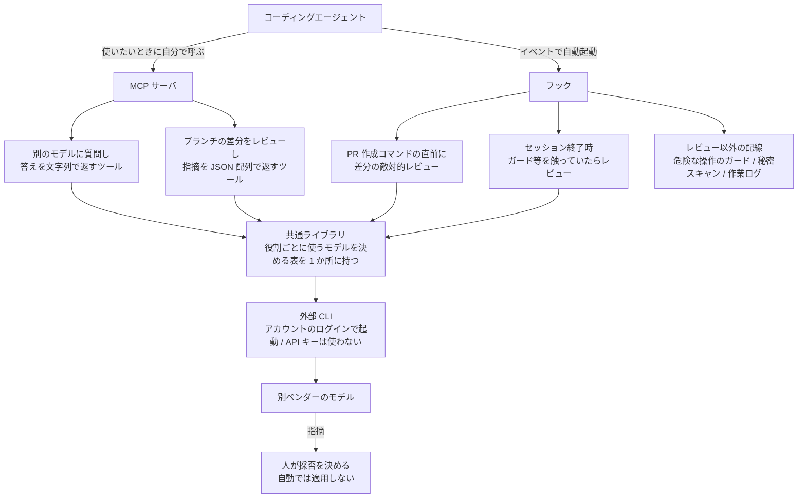

AIコーディングエージェントを毎日使っていると、あるとき使用量の画面を見て手が止まります。私がそうでした。上限に当たるようになり、このまま同じ使い方を続けても下がらないな、と思ったのが始まりです。

節約というとまず思いつくのは、出力を短くさせるとか、軽いモデルに切り替えるとか、一回あたりを安くする方向の工夫です。ひととおり試しましたが、効きが薄い。しばらくして分かったのは、私の場合に効いていたのは一回の重さではなく**回数**だったということです。同じところを何度も作り直していました。

## 高くつくのは、作り終わってからの設計変更

手戻りのトークンは高くつきます。書き直す分そのものより、そこまでの経緯を読み直させるコンテキストが毎回ついてくるのが重い。実装が一通り終わってから設計の誤りに気づくと、現状を全部読ませ直すところからやり直しになります。ファイルが増えているぶん、最初に作ったときより読ませる量は多くなっています。

裏を返すと、無駄なコンテキストを焼かずに済めば、トークンも減ります。手戻りを減らすことがそのままコスト対策になる、という順番です。一回を安くするより、作り直しの回数を減らすほうへ賭けることにしました。

## 別のベンダーのモデルに、あら探しをさせる

そこで入れたのが、別ベンダーのAIモデルによるレビューです。普通のコードレビューと違うのは、指示を敵対的な方向に振り切ってあること。よくできている点は挙げさせません。壊れる条件、迂回できる経路、説明と実装が食い違っている箇所だけを出させます。

なぜ別のベンダーなのか。LLMはどれだけ高性能になっても、学習データと評価のしかたによる偏りが残ります。同じモデルに自分の書いたものをレビューさせると、書いたときと同じ偏りで読むことになるので、その偏りが見落としている範囲はそのまま見落とされます。別のデータと別の基準で作られたモデルなら、偏りの向きが違うぶん、こちらが当然だと思っていたところに手をかけてきます。

運用そのものは単純で、差分がまとまった段階で自動的に走らせ、返ってきた指摘を直してから次の作業に進みます。実装を進める前に潰しておくので、あとから設計を見直すとか、おかしなものがリリースに乗るとか、そういう一番高くつく失敗が減ります。

## 自動で走る経路と、自分で呼ぶ経路

呼び出し口は2つあります。ひとつはMCPサーバとして2つのツールをエージェントに見せておき、使いたくなったらエージェント自身に呼ばせる形。もうひとつはエージェントのイベントに紐づけたフックで、こちらは呼ぶのを忘れても勝手に走ります。どちらも同じ共通ライブラリを通って、外部のCLIを起動するところで合流します。

図では並べて描いていますが、この2つは性格が違います。自分で呼ぶほうは相談にも翻訳にも使える汎用の口で、そのぶん呼び忘れれば何も起きない。フックのほうは、PRを出すコマンドを打った瞬間と、ガードのような壊れると困る部分を触ったままセッションを終えようとした瞬間に、こちらの意思と関係なく差分を持っていきます。私が実際に助かっているのは後者です。

共通ライブラリに置いてあるのは、レビュー役・書く役・仕分け役といった役割ごとにどのモデルを使うかを決めた表で、呼ぶ側はモデル名を知りません。乗り換えるときに直すのは1か所です。そして経路がどちらであっても、返ってくるのは指摘までで、直すかどうかは人が決めます。

なお、図に出ている配線はレビューだけではありません。ガードも秘密スキャンも作業ログも同じフックの仕組みに相乗りしています。次に書く300行弱という数字は、このうちレビューの本体だけを切り出したものです。

## 作ったのは2ファイル、300行弱

割に合うかが気になると思うので、かかったものを先に書きます。レビューを手で回すスクリプトが140行で、最初に動いたのが2026-09-12。作り始めた翌日です。編集を検知して自動で起動する部分が143行で、こちらが翌2026-09-13。この仕組みの本体はこの2ファイル、合わせて300行弱しかありません。手で回すだけなら1日、自動起動まで入れて2日。ただしこれは切り出した数字で、周辺を含めた基盤全体には2026-09-11から09-18の8日間で169コミット入っています。レビューの部分はその一部でしかない、というのが正確なところです。

費用のほうは、使っているCLIをアカウントのログインだけで動かしていて、APIキーを渡していません。そのCLI自体はアカウントを作ってログインすれば無料のプランで始められます（その場合の上限は週ごとにリセットされます）。従量課金が発生しない代わりに、使えるのはアカウントに紐づく上限までです。上限に当たったら待ちます（有料クレジットへ自動で落ちる設定は切ってあります）。やめるのも軽くて、フックの設定から1行消せば自動起動は止まり、スクリプトを呼ばなければ手動でも動きません。始めるときも同じで、最小構成は手で回すスクリプト1本とCLIのログインだけです。MCPサーバも自動で起動させる仕掛けも後回しでいい。差分がまとまった段階で自分でコマンドを叩き、返ってきたものを再現してから直す。私も最初の1日はそれだけでした。

## 返ってきた指摘は鵜呑みにしない

具体例をひとつ。自作の作業基盤に、危ない操作を止めるガードを入れてあります。2026-09-14、変更をマージに出す前に手でこのレビューを回したら、構造的な穴が5件返ってきました。中でも効いたのは、コマンドの行頭に空白やタブを一つ入れるだけでガードの判定を丸ごと迂回できる、という指摘です。書いた本人は行頭から始まる形でしか試していなかったので、まったく見えていませんでした。

ただ、指摘をそのまま信じて直すことはしません。まず指摘どおりの入力を作って、本当に素通りするかを再現します。再現したらそれをテストとして固定してから直す。この回は5件とも再現できて全部当たりでしたが、外れる回もあるので順序は変えていません。再現から入ると、直したあとにテストが残るという副産物もあります。

## 実作業まで任せるなら、隔離は自分で用意することになる

レビューが効いたので、同じモデルに実装そのものも任せられないかを試しました。ここで予定が狂います。

そのCLIにはサンドボックスのオプションがあったので、作業させたいディレクトリをカレントディレクトリにして起動すれば安全だろうと考えていました。2026-09-14に起動オプションの組み合わせを4通り試したところ、その想定はほとんど外れました。サンドボックスを付けるとカレントディレクトリは無視され、CLI自身がホーム配下に持つ作業用の領域にファイルが作られる。シェルの実行も全部キャンセルされる。逆に権限の確認を全部飛ばすと狙ったディレクトリで動きますが、今度は何も絞れていない。その中間にあたる「編集だけ許してシェルは確認する」設定では、応答が空のまま、ファイルも作られませんでした。対話なしの自動実行では拒否が一度出た時点でその回が終わってしまうためで、中間の設定は実質「何もできない」と同じでした。

結局、ツール側で権限を絞る道は諦めて、隔離は呼ぶ側で作りました。使い捨ての作業ツリー（gitのworktree）を切ってそのパスだけを渡し、出来上がった差分は人が読む前に機械で検査します。秘密情報が混ざっていないか、設定やCIに手が入っていないか、本体側のファイルが動いていないか。

正直に書いておくと、ツールの実行が常に自動承認になる以上、「その領域の外に出られない」とは言えません。言えるのは「出たら検出する」までで、git の管理外のファイルやリポジトリの外は検出すらできません。強い保証があるように書くほうが危ないので、そのまま書いています。

## 最後に決めるのは人間のまま

2026-09-14に一度、テストコードを書かせてみました。13本のテストが入ったファイルが返ってきて、こちらが直したのは考えの途中経過が残ったコメントと行末の空白くらいです。品質としては十分でした。

それでも採否は人が決めています。AIだけで判断まで閉じさせたものは経験上あまり品質が良くないので、ここは便利さと引き換えにしていません。

## チームで使った実績は無い

人に渡せるのかという話は、書けないことから先に書きます。これは個人開発で、チームに入れた結果を私は持っていません。複数人で回したときに何が起きるかは分からない、が本当のところです。渡す前提の作りにはしてあって、配布用のスクリプトで登録済みの9リポジトリへ同じ仕組みをまとめて入れられますし（手元の複数のアプリで実際に動かしています）、ガードには、素通りするはず／止まるはずの入力を並べた対照テストが351件と、それとは別に単体テストが144件あります。判定を迂闊に緩めればテストが赤くなるので、壊したまま配ることは一応できません。ただ、渡せる形にしてあることと、渡して回ったことは別の話です。

人が増えたときに最初に壊れるのは、たぶんガードそのものではなく誤検知の調整のほうだと思っています。何を止めて何を通すかの線引きが私の感覚で引いてあって、根拠が私の中にしかない。今もヒアドキュメントで文書を書こうとすると自分のガードに止められる不便が残っていて、これは書き方を変えることで吸収しています。ひとりなら「まあいいか」で済みますが、他人が同じことを踏んだら、たぶんガードごと外されます。そこをどう設計するかの答えは、まだ持っていません。

## 安くなったかは、測っていない

正直に書くと、これでトークン代がいくら下がったのかは計算していません。同じ条件で比較する手間をかけていないので、何割削減といった数字は出せません。

金額の代わりに数えているのは、レビューを何回走らせて、そのうち何件が本当に当たったかです。再現を試して判定を書き終えた回だけを並べます。

| 日付 | 見せたもの | 指摘 | 内訳 |
|---|---|---|---|
| 2026-09-13 | リポジトリ全体 | 18 件 | 当たり 8 / 条件付き 2 / 外れ 5 / 利用者判断 3 |
| 2026-09-14 | マージに出す前の差分 | 5 件 | 全件当たり（うち重大 4） |
| 2026-09-18 | ガードを編集した直後（自動起動） | 6 件 | 全件外れ |
| 2026-09-18 | 作業の振り返りそのもの | 9 件 | 当たり 5 / 外れ 2 / 対応不要 2 |

合計38件、当たりは18件です。ただ、この合計にはあまり意味がありません。的中率が回によって100%から0%まで振れているので、平均を取ると「だいたい半分当たる」という、どの回にも当てはまらない数字になります。

丸ごと空振りした3行目は、モデルの調子ではなく渡し方の問題でした。このときレビューに入ったのは、守ってほしい制約を書いた文書の差分だけです。その制約を実際に強制している実装（実行できるツールの許可リストと、コマンドを判定するガード本体）は差分に含まれていないので読まれていない。返ってきた6件は全部「こういう実装になっている場合」という仮定から書かれていて、実入力を通してみると、抜けると言われた操作は止まり、誤って止まると言われた操作は素通りしました。レビュー対象の選び方を外すと、返ってくるのは推測だけになります。

この回は外れが分かったあとも対照としてテストに足したのですが、そこでもう一つ落ちました。保護対象の隣に書き込む操作を「止まるはず」と書いたら、テストが失敗した。調べるとガードはディレクトリ名の一致ではなく解決後のパスで判定していて、期待値のほうが間違っていました。外れの回でも、自分の思い込みの棚卸しにはなっています。

それでも早い段階で叩いてもらう価値はあると思っています。当たったほうの中身が、あとから気づいたら作り直しになっていた類だからです。行頭に空白を足すだけでガードが全部素通りになる件は、マージしてから見つかっていたら、そのガードが効いている前提で書いた周辺まで見直しになっていました。

手戻りが減ったという実感もあります。設計の穴が早い段階で出てくるようになり、作り終わってから作り直す回数が目に見えて落ちました。無駄なコンテキストを焼かなくなった分、トークンも減っているはずだと考えています。とはいえ、これは実感であって計測ではありません。

コストの数字が欲しい人には弱い話のままです。ただ、もし今トークンの使用量で困っていて、心当たりが「同じところを何度も作り直している」ことなら、一回あたりを軽くする工夫より先に、別のベンダーのモデルに早めに叩いてもらうほうが効くかもしれません。毎回当たるわけではないので、返ってきたものを再現してから直す手順だけは一緒に用意してください。
